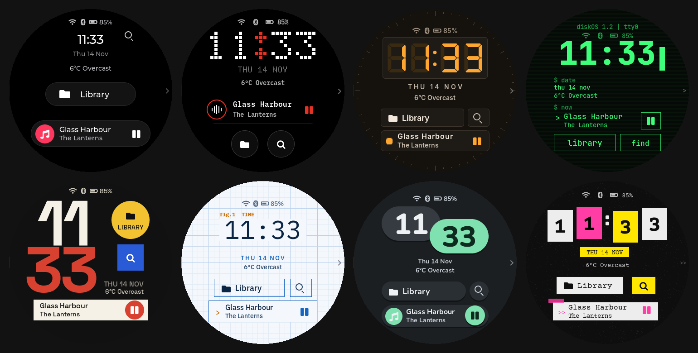
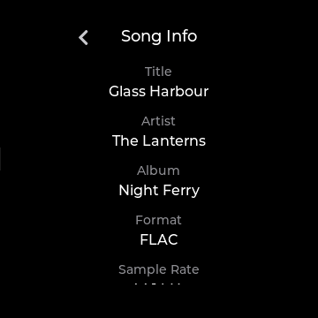
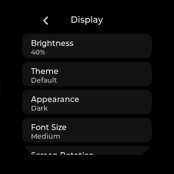
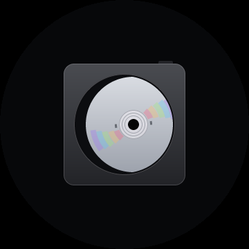

<p align="center">
  
</p>

<h1 align="center">diskOS</h1>

<p align="center">
  A round-screen music interface for the FiiO Snowsky Disc, built on its stock audio engine.
</p>

<p align="center">
  <a href="docs/INSTALL.md#host-support"></a>
  <a href="#current-limitations"></a>
  <a href="LICENSE"></a>
  <a href="ui/COPYING"></a>
  <a href="https://ko-fi.com/b0hemia"></a>
</p>

<p align="center">
  <a href="#see-diskos">Screenshots</a> |
  <a href="#before-you-install">Before you install</a> |
  <a href="#install">Install</a> |
  <a href="#update-restore-recover">Restore</a> |
  <a href="#documentation">Docs</a> |
  <a href="#contributing">Contribute</a>
</p>

> [!CAUTION]
> **diskOS is an unsupported beta. Installation rewrites the Disc's main root filesystem.**
> Power loss, host sleep, a bad cable, or an interrupted flash can leave the player unbootable
> or require hardware recovery. Recovery worked on tested units but is not guaranteed.
> Back up your music and keep the saved stock image on separate storage before installing.

## At a glance

- **Device:** FiiO Snowsky Disc.
- **Release described here:** diskOS and installer 1.2.2; beta.
- **Stock firmware supported:** V2.09, V2.28, V2.40, and V2.57.
- **Hosts:** Linux x86-64 (Debian, Ubuntu, Arch, CachyOS, Fedora); macOS Apple Silicon release package. Intel Macs can build the native tools.
- **Flash time:** about 20 minutes, including the firmware check and verification.
- **Going back:** restore the saved stock image, boot the stock UI once, or set stock as the default UI.

## See diskOS

<table>
<tr>
<td align="center"><br><sub>Now Playing</sub></td>
<td align="center"><br><sub>Eight themes</sub></td>
<td align="center"><br><sub>Up Next</sub></td>
</tr>
<tr>
<td align="center"><br><sub>Timed lyrics</sub></td>
<td align="center"><br><sub>Song Info</sub></td>
<td align="center"><br><sub>Album cover flow</sub></td>
</tr>
<tr>
<td align="center"><br><sub>Search and keyboard</sub></td>
<td align="center"><br><sub>Make it yours</sub></td>
<td align="center"><br><sub>Startup</sub></td>
</tr>
</table>

**[See every screen in the diskOS tour](docs/TOUR.md).**

## Built around the Disc

### For listening

- [Now Playing](docs/TOUR.md#now-playing) puts music controls on the round display.
- [Up Next](docs/TOUR.md#up-next) shows the player's queue and lets you jump within it.
- [Lyrics and Song Info](docs/TOUR.md#song-info-and-lyrics) show words and available file details.
- [Library and cover flow](docs/TOUR.md#library) offer several ways to browse indexed music.
- [Playlists, favourites, and books](docs/TOUR.md#playlists) keep different listening collections close.
- [Themes and display choices](docs/TOUR.md#eight-themes) change the look of the interface.

### For tinkering

- [Display settings](docs/TOUR.md#settings-display) let you change theme, type size, and artwork behavior.
- [Quick Settings](docs/TOUR.md#quick-settings) lets you choose the controls in the pull-down drawer.
- [System settings](docs/TOUR.md#settings-system) include Debug Mode for temporary SSH access.
- [Updates and startup](docs/TOUR.md#updates-startup-and-power) explain keyed app updates and boot behavior.
- [Stock UI choices](docs/TOUR.md#safety-and-stock-ui) give you an interface fallback; [restore](docs/INSTALL.md#restore-stock-and-recover) removes the diskOS image.

## Before you install

You need a FiiO Snowsky Disc, its matching unmodified official FiiO firmware ZIP, a reliable
USB cable, Python 3.8 or newer, and about 20 uninterrupted minutes. The installer builds the
root filesystem image on your computer; this project does not distribute FiiO's root filesystem.
Keep a separate copy of the saved stock image and read the [full requirements](docs/INSTALL.md#requirements).

The 1.2.0 upgrade from 1.1.3 requires a **full flash** with the complete 1.2.0 installer and
matching flash tools. An in-app update cannot replace the boot components in that image.
The installer checks the selected firmware and the Disc before it writes.
If it refuses a firmware archive, use a matching unmodified official ZIP.
Read the on-screen message before retrying a failed flash.

## Install

Run setup from the extracted release package, then start the graphical installer:

```sh
./install.sh
./diskos-installer gui
```

Choose **Install diskOS**, select the official firmware ZIP, and normally choose the **Public**
variant. Power off the Disc, hold **Volume Down**, and connect USB to enter mask-ROM mode; the
screen stays black. Confirm the warning in the installer, keep the computer awake, and wait for
verification before power-cycling the Disc. The Public variant has no always-on root shell;
Debug Mode can enable temporary SSH on the Disc.

For the command line, the equivalent install is:

```sh
./diskos-installer install --firmware SNOWSKY_DISC_update_*.zip --variant public
```

Read the [installation guide](docs/INSTALL.md) for OS packages, USB permissions, source checkouts,
options for your own build, and error codes. Do not run the installer with `sudo`.

## Update, restore, recover

Installing 1.2.0 requires a full flash; it installs the in-app update feature. The 1.2.0
release image includes the diskOS release key by default, so the first update over Wi-Fi will
be a later signed release. Settings > System > Update diskOS updates only the diskOS app, not
stock firmware or the whole image. Turn updates off on the Disc, or untick **Allow diskOS updates
over Wi-Fi** when flashing. See [upgrading](docs/INSTALL.md#upgrading-to-120).

To use the stock interface without reflashing, set **Settings > System > Default UI > Stock**,
or hold **Volume Up** from power-on for a one-time switch. To remove the diskOS image, use the
installer's `restore-stock` command with its saved stock root filesystem. A failed flash may need
mask-ROM reflashing; recovery is not guaranteed. Read [restore and recovery](docs/INSTALL.md#restore-stock-and-recover)
before you need it.

## Current limitations

Local music playback is the best established path. Weather, Last.fm, and Bluetooth codec behavior
remain experimental. After a restart, Wi-Fi can take up to about a minute to connect; if it
shows no IP, reconnect in Settings > Wi-Fi. A fix is planned for 1.2.1.
An indexed file format may still fail to play on the Disc.
The stock player and connected headphones also affect some audio and Bluetooth choices.
On V2.09, playlist and book playback may fail; on V2.57, the Custom EQ editor is view-only.
Read the [tour's limits](docs/TOUR.md#limits) and [privacy disclosure](docs/PRIVACY.md).
This project is not affiliated with or endorsed by FiiO, Snowsky, or Ingenic.

## How it works

diskOS replaces the stock interface while keeping the stock player and audio engine.
The installer extracts your official FiiO firmware locally, saves a stock image for restore,
and adds diskOS to a new root filesystem image. It flashes that image over the Disc's mask-ROM
USB mode and verifies the written blocks. A boot hook starts the diskOS UI; the stock UI remains
available as a fallback. See the [hardware notes](docs/HARDWARE.md) for the device layout.

## Documentation

Start with the [documentation index](docs/README.md) for installation, the screen-by-screen tour,
development notes, hardware research, privacy, and license information.

## Contributing

Bug reports, hardware findings, documentation fixes, and focused patches are welcome.
Read [CONTRIBUTING.md](CONTRIBUTING.md) before changing flashing or security-sensitive code.
Report vulnerabilities privately through [SECURITY.md](SECURITY.md).

## License and support

The installer, scripts, and documentation are MIT licensed; see [LICENSE](LICENSE).
The on-device UI source in [ui/](ui/) is GPL-3.0-or-later; see [ui/COPYING](ui/COPYING).
Third-party license details and corresponding source are listed in [NOTICE.md](NOTICE.md),
[SPL_SOURCE.md](SPL_SOURCE.md), and [licenses/](licenses/).

DiskOS is an open-source hobby project maintained by b0hemia, with community contributions.
Tips are optional, but they help keep testing, reverse-engineering, documentation, and release
work moving.

<p align="center">
  <a href="https://ko-fi.com/b0hemia">
    
  </a>
</p>

> [!WARNING]
> Do not redistribute generated `diskos_*.bin` images. They contain FiiO's root filesystem.
> Build them locally from firmware you obtained from FiiO and share the installer instead.
